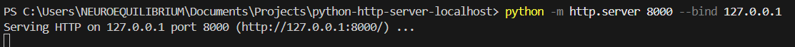
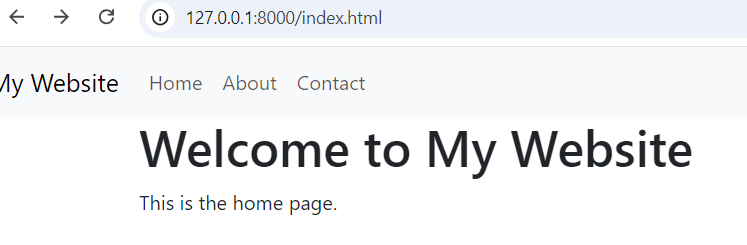

# Localhost Web Server for Testing Static HTML, JavaScript

This project provides a simple way to test static web pages using Python's built-in HTTP server. It supports serving HTML, JavaScript, CSS (including Bootstrap), and other assets locally via `http://localhost`.

---

## Features

- Serves static files including HTML, JavaScript, CSS, and images.
- Uses Python's lightweight HTTP server.

---

## Prerequisites

- **Python** (Version 3.7 or later recommended)
- A browser (e.g., Chrome, Firefox, Edge) for testing the web pages.

---

## File Structure

Here is an example file structure for your project:

```
my_website/
├── index.html      # Home page
├── about.html      # About page
├── contact.html    # Contact page
```

---

## Setup Instructions

1. Clone or download this repository.
2. Navigate to the project directory in your terminal or PowerShell:


3. Start the Python HTTP server:

   ```bash
   python -m http.server 8000 --bind 127.0.0.1
   ```

   - The server will run on `http://127.0.0.1:8000`.
  
     

4. Open your browser and navigate to:

   ```
   http://localhost:8000
   ```
    
---

## Why Use Localhost Instead of Directly Opening Files?

When you directly open HTML files in your browser, the browser uses the `file://` protocol instead of `http://`. This can cause several issues:

1. **Security Restrictions:**
   - Modern browsers impose strict security policies on `file://` resources to prevent malicious scripts. For example, JavaScript files might fail to load due to Cross-Origin Resource Sharing (CORS) policies.

2. **Relative Path Issues:**
   - Relative paths in your project might not resolve correctly when using `file://`, leading to missing styles, scripts, or assets.

3. **Simulating a Web Server Environment:**
   - Using `http://localhost` allows you to test your project in an environment closer to a real web server, which is how your site will behave when deployed.

4. **Dynamic Features Testing:**
   - If your project includes AJAX requests or uses libraries like Bootstrap, they often require an HTTP server to function properly.

By using localhost, you can ensure your project behaves as expected in a web environment.

---

## Notes

- **Stopping the Server:** Press `Ctrl+C` in the terminal to stop the server.
- **Custom Port:** To use a different port, replace `8000` in the command with your desired port number.

---

## License

This project is licensed under the MIT License.
